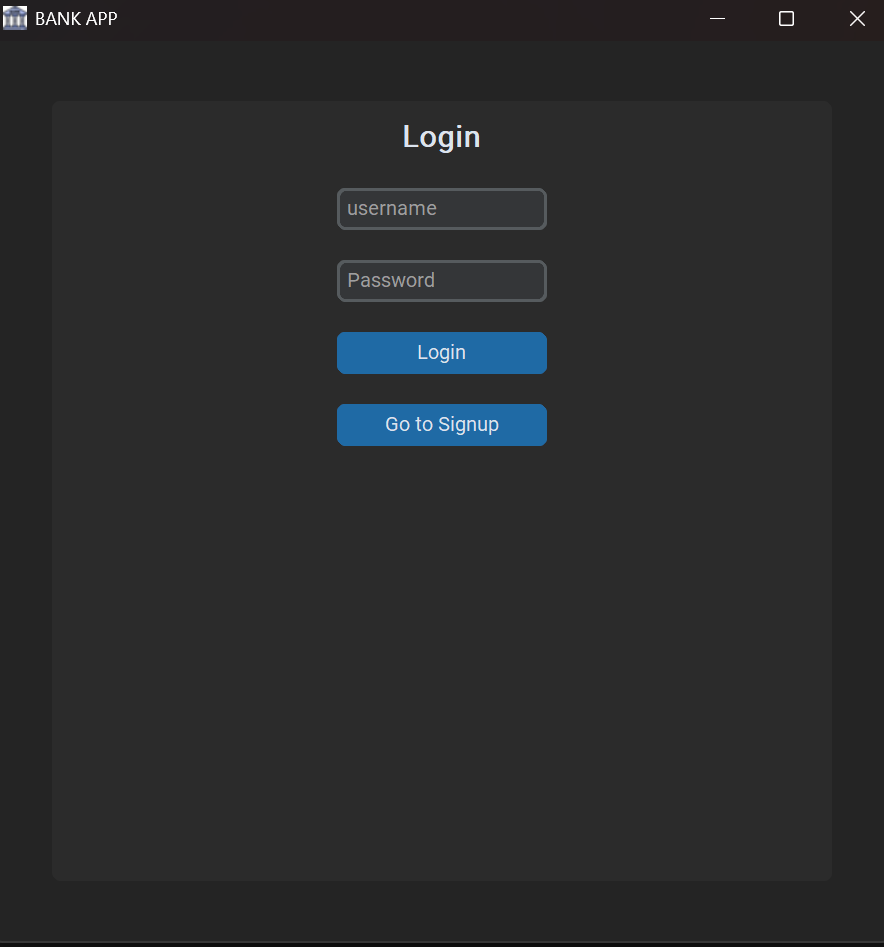
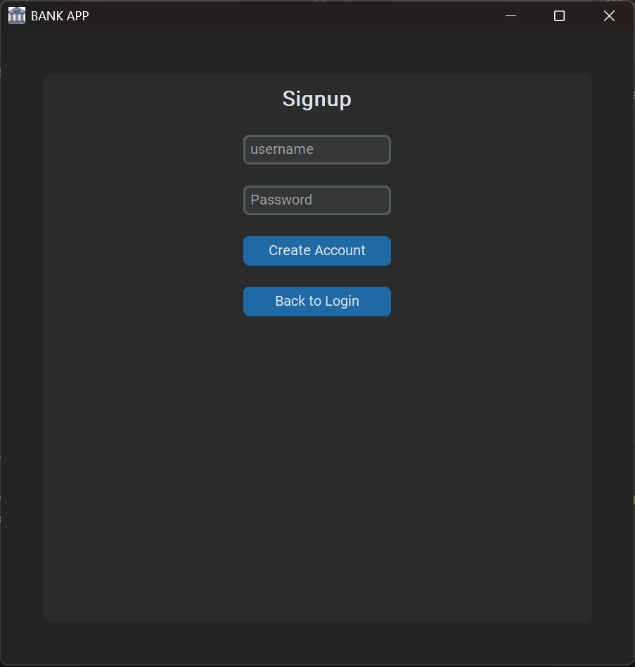
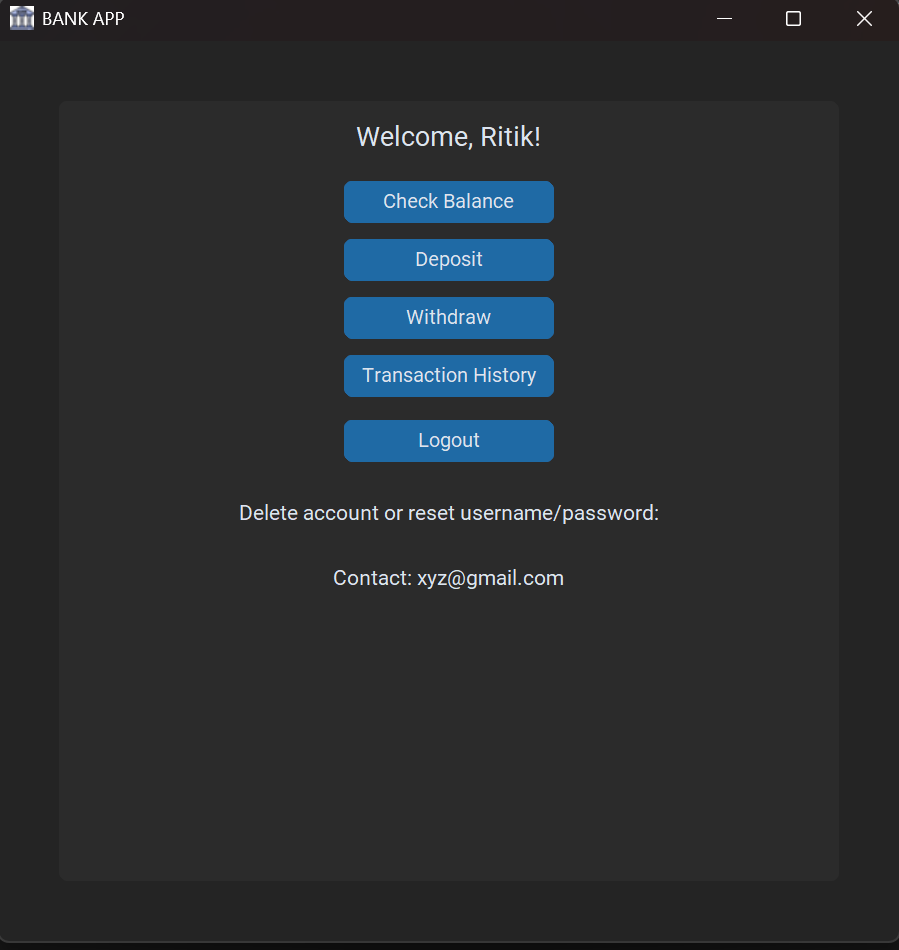

# 🏦 Bank App (Python + CustomTkinter)

A beginner-friendly **Bank Management Application** built in Python using **CustomTkinter**.  
You can **sign up**, **login**, **deposit**, **withdraw**, and **check balance**. Transactions are saved securely with user roles support.

---

## 📌 Features
- 🔑 **Signup & Login** with password hashing (SHA256)
- 👥 **Role-based Access**  
  - **Member** → Deposit, Withdraw, Check Balance  
  - **Head (Admin)** → Manage users, View all transactions  
- 💰 **Deposit & Withdraw** money safely
- 📜 **Transaction History** stored automatically
- 🎨 **Modern UI** with CustomTkinter
- 🖼 **Custom App Icon** (`bank.ico`)

---

## 🧠 Concepts Used
- GUI with **CustomTkinter**  
- **File Handling** for user and transaction data  
- **Hashing** (`hashlib`) for secure passwords  
- **Datetime** module for transaction logs  
- **OOP (Classes & Methods)** in Python  
- **Conditional logic** and input validation  

---

## 🚀 How to Run

Make sure Python 3 is installed.  
Install required dependency:

```bash
pip install customtkinter
```

Run the app:

```bash
python bank_app.py
```

---

## 🖥 App Preview

```
------ BANK APP ------
[1] Login / Signup
[2] Deposit
[3] Withdraw
[4] Check Balance
[5] View Transactions
[6] Exit
----------------------
```

---

## 📂 Project Structure
```
bank-app/
│
├── bank_app.py    # Main Python script
├── bank.ico       # App icon
└── README.md      # Project documentation
```

> **Note:** User data and transactions are stored automatically in text files when you use the app.

---

## 📸 Screenshots
### 🔑 Login Page


### 📝 Signup Page


### 🏠 Dashboard


---

## 📜 License
This project is licensed under the [**MIT License**](../LICENSE).  
You are free to use, modify, and share it with proper credit.
